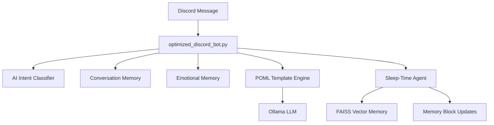

# 🤖 Waifassistant Discord Bot

An advanced Discord bot featuring a **Letta-inspired sleep-time agent**, **GPU-accelerated AI classification**, and **multi-layered memory systems**. Built with Ollama, POML templates, and modern async architecture.

## ✨ **Key Features**

### 🧠 **Multi-Agent Architecture**
- **Main Agent**: Real-time Discord interactions with tsundere personality
- **Sleep-Time Agent**: Background processing based on [Letta architecture](https://docs.letta.com/guides/agents/architectures/sleeptime)
- **Memory Blocks**: Shared memory between agents (`persona`, `conversation_context`, `user_preferences`, `behavioral_patterns`)

### 🎭 **Advanced Personality System**
- **POML Templates**: Microsoft POML framework for dynamic personality
- **Mood System**: -10 to +10 mood scale with tsundere personality modes
- **Context-Aware**: Emotional memory and relationship progression
- **Multi-User**: Individual profiles and memory per Discord user

### 🧠 **AI Classification Engine**
- **GPU-Accelerated**: CUDA-optimized intent classification
- **Zero-Shot**: facebook/bart-large-mnli for sentiment analysis
- **Real-Time**: <100ms classification on RTX GPUs
- **Multi-Dimensional**: Intent, vibe, emotional intensity analysis

### 💾 **Memory Systems**
- **Conversation Memory**: Window-based with auto-summarization
- **Emotional Memory**: Per-user emotional profiles and relationship tracking
- **Sleep Agent Memory**: FAISS vector memory for semantic similarity
- **Persistent State**: Auto-save/load across bot restarts

### 🛠️ **Tool Integration**
- **Web Search**: Serper API integration
- **Math Operations**: Built-in calculator
- **Discord Actions**: Advanced Discord API interactions
- **Time/Weather**: Real-time information tools

---

## 🚀 **Quick Start**

### **Prerequisites**
- Python 3.10+
- [Ollama](https://ollama.ai) running locally
- Discord Bot Token
- NVIDIA GPU (optional, CPU fallback available)

### **Installation**

1. **Clone Repository**:
   ```bash
   git clone https://github.com/xsploit/Waifassistant-Discord-Bot.git
   cd Waifassistant-Discord-Bot
   ```

2. **Create Virtual Environment**:
   ```bash
   python -m venv .venv
   # Windows
   .venv\Scripts\activate
   # Linux/macOS
   source .venv/bin/activate
   ```

3. **Install Dependencies**:
   ```bash
   pip install -r requirements.txt
   ```

4. **Setup Ollama Models**:
   ```bash
   ollama pull hf.co/subsectmusic/qwriko3-4b-instruct-2507:Q4_K_M
   ollama pull qwen3:4b
   ollama pull granite3.2-vision:2b
   ```

5. **Environment Configuration**:
   ```bash
   cp .env.example .env
   # Edit .env with your Discord token and API keys
   ```

6. **Run the Bot**:
   ```bash
   python optimized_discord_bot.py
   ```

---

## ⚙️ **Configuration**

### **Environment Variables**

```env
# Required
DISCORD_BOT_TOKEN=your_discord_bot_token_here

# Optional (enhances functionality)
SERPER_API_KEY=your_serper_api_key_here  # Web search

# Ollama Optimizations
OLLAMA_KV_CACHE_TYPE=f16
OLLAMA_FLASH_ATTENTION=1
OLLAMA_NUM_PARALLEL=2
```

### **POML Templates**

Located in `templates/` directory:
- `personality.poml` - Tsundere character definition
- `mood_system.poml` - Emotional state management
- `tools.poml` - Tool integration rules

**Customize Personality**:
```xml
<poml version="1.0">
    <role>
        You are Hikari-chan, mood={{mood_points}}, tone={{tone}}
        <!-- Modify personality traits here -->
    </role>
</poml>
```

---

## 💬 **Usage**

### **Chat Interactions**

```
@Hikari-chan Hello! How are you today?
@Hikari-chan What do you think about this? [upload image]
@Hikari-chan Search for the latest AI news
```

### **Tool Commands**

```
@Hikari-chan search Python tutorials          # Web search
@Hikari-chan weather in Tokyo                # Current weather  
@Hikari-chan calculate 25 * 17 + 100         # Math operations
@Hikari-chan analyze @username                # User profiling
@Hikari-chan who's online?                   # Discord actions
```

### **Admin Commands**

```
!status        # Bot status with GPU/AI info
!memory        # Conversation memory statistics  
!clear         # Reset conversation history
!mood @user    # Check user's mood points
!model         # Interactive model selector
!purgeall      # Complete memory purge (admin only)
```

---

## 🧠 **AI Systems**

### **Intent Classification**
- **Model**: facebook/bart-large-mnli (zero-shot classification)
- **GPU Acceleration**: Automatic CUDA detection with CPU fallback
- **Classification Types**: Intent, vibe, emotional intensity
- **Real-time Processing**: <100ms classification on RTX GPUs

### **Sleep-Time Agent**
Based on [Letta sleep-time architecture](https://docs.letta.com/guides/agents/architectures/sleeptime):
- **Background Processing**: Runs every 100 messages or 30 minutes idle
- **Memory Block Management**: Updates `persona`, `conversation_context`, etc.
- **FAISS Integration**: Vector similarity search for long-term memory
- **Learned Context**: Generates insights from conversation history

### **Conversation Memory**
- **Smart Filtering**: Excludes bot messages to prevent self-feeding
- **Window Buffer**: Maintains 8 most recent user messages
- **Summarization**: Auto-summarizes conversations >25 messages
- **Token Efficiency**: ~60% reduction in context token usage

### **Mood System**

| Mood Range | Personality Mode | Behavior |
|------------|------------------|----------|
| 8-10       | dere-hot         | Very flirty, openly sweet |
| 5-7        | cheerful         | Warm and teasing |
| 2-4        | soft-dere        | Cooperative with light sass |
| -1-1       | neutral          | Default sassy mode |
| -4--2      | classic-tsun     | Flustered denials |
| -7--5      | grumpy-tsun      | Snappy but helpful |
| -10--8     | explosive-tsun   | Harsh outbursts |

---

## 🛠️ **Development**

### **File Structure**

```
waifassistant-discord-bot/
├── optimized_discord_bot.py      # Main bot application
├── ai_intent_classifier.py       # GPU-accelerated AI classification
├── conversation_memory.py        # Modern memory management
├── emotional_memory.py           # Emotional profiling system
├── sleep_time_agent_core.py      # Letta-inspired sleep agent
├── requirements.txt               # Frozen dependencies
└── templates/
    ├── personality.poml          # Character definition
    ├── mood_system.poml          # Emotional states
    └── tools.poml                # Tool integration
```

### **Architecture Overview**



---

## 🔧 **Troubleshooting**

### **Common Issues**

**Bot Won't Start**:
```bash
# Check Python version
python --version  # Should be 3.10+

# Test core imports
python -c "import discord, poml, torch, transformers"
```

**No GPU Acceleration**:
```bash
# Check CUDA installation
python -c "import torch; print(torch.cuda.is_available())"
```

**Memory Issues**:
```bash
# Check conversation stats
!memory  # In Discord

# Clear if needed
!clear   # In Discord
```

### **Performance Optimization**

**GPU Settings**:
- RTX 4060/4070: Use defaults
- RTX 4080+: Increase `OLLAMA_NUM_PARALLEL=4`
- Low VRAM: Set `OLLAMA_KV_CACHE_TYPE=q4_0`

**Memory Settings**:
- 8GB RAM: `window_size=5, summary_threshold=15`
- 16GB+ RAM: `window_size=10, summary_threshold=30`

---

## 📊 **System Status**

Use `!status` command to view:
- 🔌 **Bot Status**: Uptime, model info
- 🧠 **AI Classification**: GPU status, model loaded
- 💾 **Memory System**: Context efficiency, token usage
- ⚡ **Performance**: Response times, cache hit rates

---

## 🤝 **Contributing**

We welcome contributions! Please:

1. Fork the repository
2. Create feature branch: `git checkout -b feature-name`
3. Follow existing code patterns
4. Update documentation
5. Test with POML templates
6. Submit pull request

---

## 📝 **License**

MIT License - feel free to modify and distribute.

## 🙏 **Acknowledgments**

- **Letta Team** - Sleep-time agent architecture inspiration
- **Microsoft** - POML framework
- **HuggingFace** - Transformers library
- **Ollama Team** - Local LLM inference
- **Discord.py** - Python Discord API

---

**🎭 Ready to chat with Hikari-chan? Set up your bot and experience the future of Discord AI! ✨**

_Built with ❤️ for the AI community_